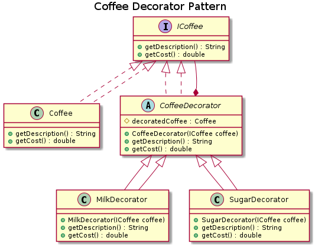

# Coffee Decorator Pattern ☕️

This project demonstrates the **Decorator Pattern**, a design pattern used to add new functionality to an object without altering its structure. Think of it like a coffee shop where you can add various toppings and customizations to a basic coffee.

## The Problem

Imagine a coffee shop with many options:

- Plain coffee
- Coffee with milk
- Coffee with sugar
- Coffee with milk and sugar
- ...and 100 other combinations.

Creating a separate class for each combination is inefficient and leads to a large number of classes. This is a maintenance nightmare, as adding a new ingredient would require creating many more new classes.

## The Solution: The Decorator Pattern

Instead of creating new classes for every combination, we start with a basic **`Coffee`** object and "wrap" it with decorators for each extra. Each decorator adds its own cost and description.

Think of it like adding layers: a basic coffee is wrapped in a "milk" layer, which is then wrapped in a "sugar" layer. Each layer adds a new feature without changing the core coffee object.

### The Players

- **`Coffee`**: The base component. It has a cost and a description.
- **`Milk` Decorator**: Adds a cost of $1.50 and the description "Milk."
- **`Sugar` Decorator**: Adds a cost of $0.50 and the description "Sugar."

### How It Works

- **Plain Coffee**: A basic `Coffee` object.
- **Coffee with Milk**: A `Coffee` object wrapped by a `Milk` decorator.
- **Coffee with Both**: A `Coffee` object wrapped by a `Milk` decorator, which is then wrapped by a `Sugar` decorator.

This approach allows for flexible, on-the-fly combinations of ingredients.

## UML Diagram



## Why This Is Smart

- ✅ **Flexibility**: Easily add new decorators (like "Cream" or "Syrup") without modifying existing code.
- ✅ **Mix and Match**: Any combination of decorators can be applied.
- ✅ **Avoids Class Explosion**: You don't need to create a class for every possible combination.
- ✅ **Reusability**: Decorator components can be reused with any base object.

-----

## Getting Started

### Prerequisites

- Java Development Kit (JDK) 8 or later
- Apache Maven

### Building the Project

Clone the repository:

```sh
git clone <repository_url>
cd coffee-decorator-pattern
```

Build the project using Maven:

```sh
mvn clean compile
```

This command cleans the build directory and compiles the source code.

### Running Tests

To run all unit tests, use the following command:

```sh
mvn test
```

This command will execute all test cases and provide a summary of the results.

### Checking Code Style

To ensure code style consistency, you can run the Checkstyle plugin:

```sh
mvn checkstyle:check
```

This command checks the code against the configured style rules and reports any violations.
